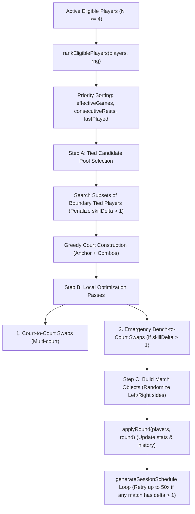
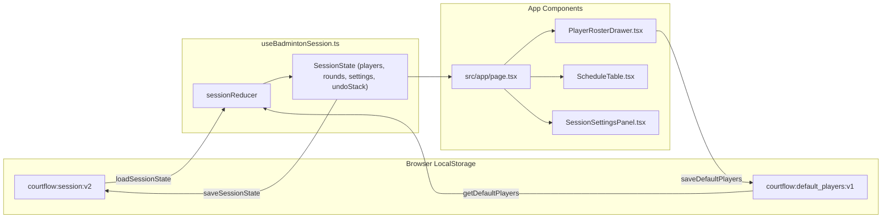

# CourtFlow — Skill System, Matchmaking Rules & Architecture Flow

> **Document Purpose**: This guide provides complete architectural context, algorithm specifications, data flows, and code invariants for AI coding agents and developers continuing work on the CourtFlow Badminton Matchmaker codebase.

---

## 1. Project Overview & Tech Stack

CourtFlow is a Next.js web application designed for intelligent badminton session matchmaking, court scheduling, and player rotation management for badminton clubs and casual groups.

- **Framework**: Next.js 15 (App Router, Client Components for interactive scheduler)
- **Language**: TypeScript (`strict: true`)
- **Styling**: Tailwind CSS with dark mode support (`lucide-react` icons)
- **State Management**: React `useReducer` with LocalStorage persistence
- **Testing**: Vitest (`npx vitest run`) + ESLint (`npm run lint`) + TypeScript (`npx tsc --noEmit`)
- **Dev Server**: `npm run dev` (running on `http://localhost:3000`)

---

## 2. Badminton Skill Grading System (Thai Standard)

Badminton clubs commonly use Thai standard skill tiers rather than arbitrary numbers. The system normalizes grades to numeric ranks `1` through `5` for mathematical balancing:

| Grade Code | Label | Numeric Rank | Description | Badge Color Token |
| :---: | :---: | :---: | :--- | :--- |
| **`nb`** | Newbie | **1** | มือใหม่ เพิ่งเริ่มเล่น พื้นฐานยังน้อย | Emerald (`bg-emerald-500/10 text-emerald-600`) |
| **`bg`** | Beginner | **2** | เบื้องต้น ตีโต้ได้ เสิร์ฟเป็น มีพื้นฐาน | Teal (`bg-teal-500/10 text-teal-600`) |
| **`N`** | Normal | **3** | มือมาตรฐาน เล่นเป็นประจำ วางลูกได้ดี | Sky (`bg-sky-500/10 text-sky-600`) |
| **`S`** | Strong | **4** | มือเก่ง แข็งแรง ตีหนัก เกมเร็ว | Amber (`bg-amber-500/10 text-amber-600`) |
| **`P`** | Pro | **5** | มือโปร นักกีฬา ตัวแทนสโมสร | Rose (`bg-rose-500/10 text-rose-600`) |

### Code References
- Implementation: `src/lib/skill.ts`
  - `normalizeSkill(val)`: Maps legacy 1-10 or 1-5 inputs to 1-5 rank.
  - `getSkillTier(val)`: Returns metadata (code, label, badgeClass).
  - `ORDERED_SKILL_GRADES`: `['nb', 'bg', 'N', 'S', 'P']`.
- UI Component: `src/components/SkillBadge.tsx`

---

## 3. Matchmaking Invariants & Hard Rules

### 3.1 Strict Team Skill Balance Rule (`skillDelta <= 1`)
- **Hard Constraint**: For any 4 players on a court, the skill difference between Team A and Team B:
  $$\text{skillDelta} = |(\text{skill}_{A1} + \text{skill}_{A2}) - (\text{skill}_{B1} + \text{skill}_{B2})| \le 1$$
- Any match pairing where $\text{skillDelta} > 1$ (e.g. $\Sigma 4$ vs $\Sigma 2$ or $\Sigma 5$ vs $\Sigma 3$) is **strictly forbidden**.

#### Mathematical Parity Principle
For any 4 integer skills $p_1, p_2, p_3, p_4$ with total sum $S$:
- If $S$ is **even**, all possible splits produce **even** differences ($0, 2, 4$). In this case, $\text{skillDelta}$ **must be 0** (e.g. 4 vs 4).
- If $S$ is **odd**, all possible splits produce **odd** differences ($1, 3, 5$). In this case, $\text{skillDelta}$ **must be 1** (e.g. 4 vs 3).
- A delta of 2 only occurred in legacy versions because the split filter was too loose. The current engine strictly enforces $\text{minDelta} \le 1$.

### 3.2 Match Type Classification: Tiered vs Carry
- **`Tiered Match` (ระดับเดียวกัน / ฝีมือสูสีกัน)**:
  - Spread $\le \text{tierThreshold}$ (default threshold: 1).
  - $\text{skillDelta} \le 1$.
  - Players are evenly matched peers.
- **`Carry Match` (มือเก่งแบกมือใหม่)**:
  - Spread $> \text{tierThreshold}$ (e.g. $N=3$ with $nb=1$ has spread 2).
  - Strongest player pairs with weakest player against middle players (e.g. $N+nb$ vs $bg+bg$).

### 3.3 Player Rest Fairness Invariants
1. **Equal Games Played**: Across a session, games played by any two active players must satisfy:
   $$\max(\text{gamesPlayed}) - \min(\text{gamesPlayed}) \le 1$$
2. **Anti-Bench Rule (No Back-to-Back Rests)**:
   $$\text{consecutiveRests} < 2$$
   No player may sit out two rounds in a row.

---

## 4. Scheduler Engine Architecture (`src/utils/scheduler.ts`)



### Algorithm Detail Breakdown:

1. **`rankEligiblePlayers(players, rng)`**:
   - Assigns priority based on:
     1. Fewest `effectiveGames` (`gamesPlayed + baselineGames`).
     2. Highest `consecutiveRests` (descending).
     3. Longest ago `lastPlayedRound` (ascending).
     4. Deterministic RNG tiebreak.

2. **Step A — Tied Boundary Pool Evaluation**:
   - Identifies `strictlyMustPlay` players (higher priority than boundary).
   - Identifies `tiedAtBoundary` players (same `effectiveGames` and `consecutiveRests`).
   - If there are multiple tied candidates, evaluates combinations of candidate subsets using `scoreGroup` to pick the subset with the lowest penalty and **guarantee $\text{skillDelta} \le 1$**.

3. **`scoreGroup(group, ctx)`**:
   - Enumerates all 3 possible doubles splits.
   - Calculates $\text{deltaOf}(s) = |(A1+A2) - (B1+B2)|$.
   - Filters candidate splits strictly:
     ```ts
     const minDelta = Math.min(...allSplits.map(deltaOf));
     const candidateSplits = allSplits.filter((s) =>
       minDelta <= 1 ? deltaOf(s) <= 1 : deltaOf(s) === minDelta
     );
     ```
   - Adds heavy penalty if $\text{skillDelta} > 1$:
     ```ts
     const unbalancePenalty = skillDelta > 1 ? (skillDelta - 1) * 5000 : 0;
     ```

4. **Step B — Emergency Bench-to-Court Swaps**:
   - If any court has $\text{skillDelta} > 1$, it checks eligible bench players.
   - If a bench player has equal games (`bEff <= cEff`) and court player didn't rest last round, it swaps them to resolve the imbalance immediately.

5. **`generateSessionSchedule(players, settings, baseSeed)`**:
   - Runs full session generation across all rounds (default 6 rounds).
   - Includes a session-level retry loop (up to 50 attempts) that verifies:
     ```ts
     if (maxDelta <= 1 && result.backToBackBenchEvents === 0) {
       bestScheduleResult = result;
       break;
     }
     ```
   - Ensures that **no round in the entire session** ever outputs an unbalanced match (such as 4 vs 2).

---

## 5. State Management & Data Flow



### Action Types in `useBadmintonSession.ts`:
- `HYDRATE`: Loads from LocalStorage on mount; generates initial schedule if empty.
- `SHUFFLE_SCHEDULE`: Re-runs `generateSessionSchedule` with new random seed.
- `ADD_PLAYER`: Appends a player and triggers clean schedule re-calculation.
- `UPDATE_PLAYER`: Updates player name or skill tier and re-balances schedule.
- `TOGGLE_ACTIVE`: Toggles player between active and resting; re-generates schedule.
- `ARCHIVE_PLAYER`: Completely deletes a player from active roster and re-balances.
- `BULK_SET_ACTIVE`: Activates or rests all players simultaneously.
- `UPDATE_SETTINGS`: Updates courtCount, gamesToGenerate, or tierThreshold.
- `SET_AS_DEFAULT`: Saves the current player roster to `courtflow:default_players:v1`.
- `RESET_SESSION`: Restores the default player roster (from LocalStorage or `INITIAL_MOCK_PLAYERS`) and clears match history.
- `TOGGLE_MATCH_COMPLETE`: Toggles match completion status.

---

## 6. Default Player Roster Reference

Initial factory default players defined in `src/lib/mockPlayers.ts`:

1. **หยก** — Skill Rank: `3` (N)
2. **พลอย** — Skill Rank: `3` (N)
3. **ช่อฟ้า** — Skill Rank: `4` (S)
4. **ตึงตัง** — Skill Rank: `3` (N)
5. **ธี** — Skill Rank: `4` (S)
6. **เป๊ก** — Skill Rank: `2` (bg)
7. **อิ๋ม** — Skill Rank: `2` (bg)

Users can customize names and grades in the **Player Management** drawer and click **"Set as Default"** to persist their customized club roster.

---

## 7. Instructions for Future AI Agents

1. **Do Not Break Engine Invariants**:
   - Always run `npx vitest run` before completing a task. All 15 tests must pass.
   - Do not weaken `skillDelta <= 1` or allow splits with delta $> 1$.
   - Do not allow back-to-back benching (`consecutiveRests < 2`).

2. **UI & Button Design Tokens**:
   - The UI uses Tailwind CSS with the design system in `src/components/ui/Button.tsx`.
   - Danger buttons must use `variant="danger"` (NOT `variant="destructive"`).
   - Primary buttons use `variant="default"`.
   - Secondary / action buttons use `variant="outline"`.

3. **No Native Browser Popups**:
   - Never use `window.confirm()` or `window.alert()`. Modern browsers block them on localhost.
   - Always use inline confirmation states (e.g. `confirmDeleteId === player.id ? <Button ...>Remove</Button> : <Trash2 />`).

4. **User Verification Rule**:
   - The user has requested: *"do not test just do the work and let me test"*.
   - Do NOT run automated browser subagents (`browser_subagent`) unless explicitly asked.
   - Run type checks (`npx tsc --noEmit`), lint (`npm run lint`), and unit tests (`npx vitest run`), then present the results clearly for the user to test in their browser.

5. **PDF Export (A4 Template)**:
   - Schedule export is generated using `src/lib/pdf.ts` (`exportScheduleToPdf`).
   - Uses an A4 print template with native vector typography, full Thai glyph fidelity, score write-in boxes, and court marshal check boxes.
